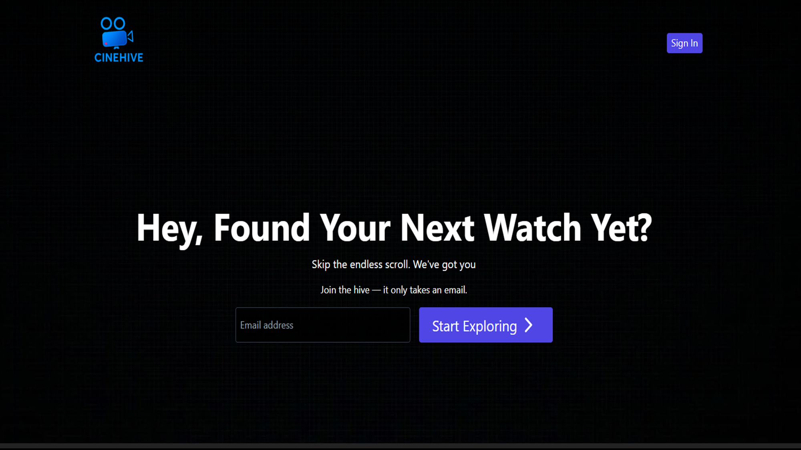
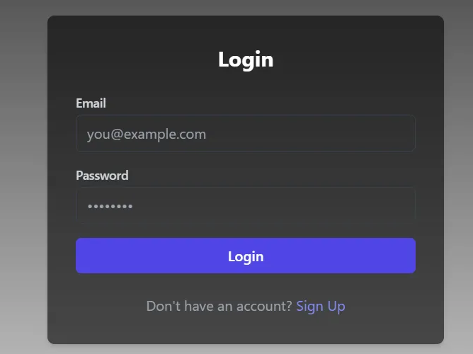
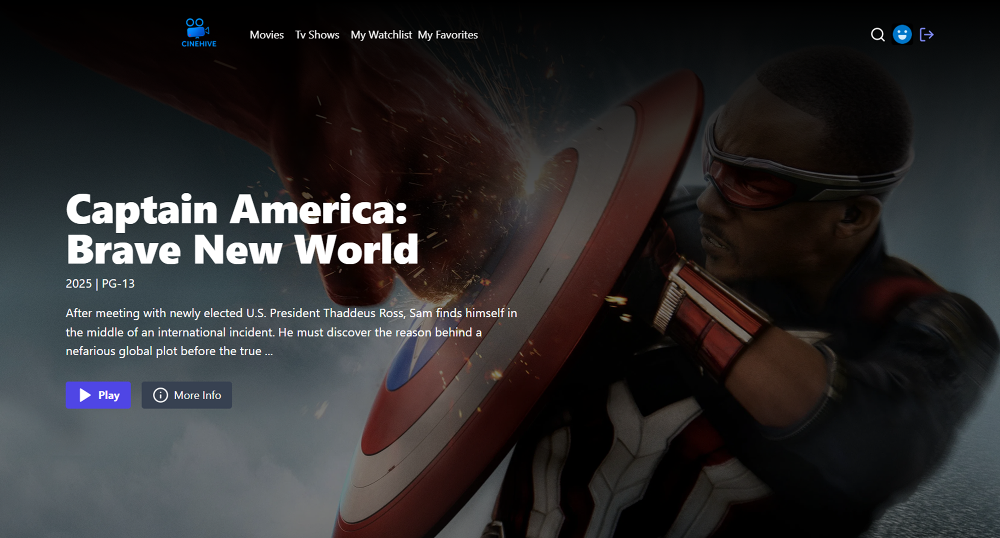
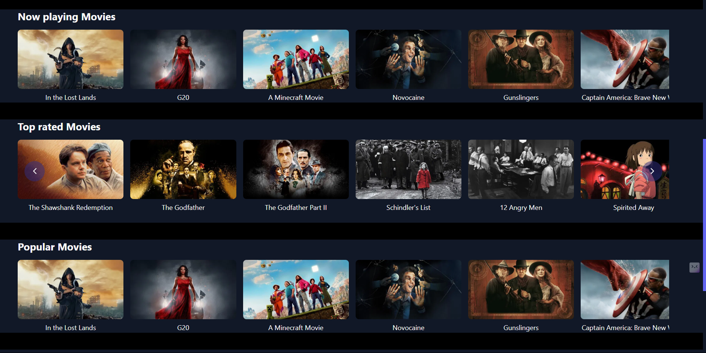
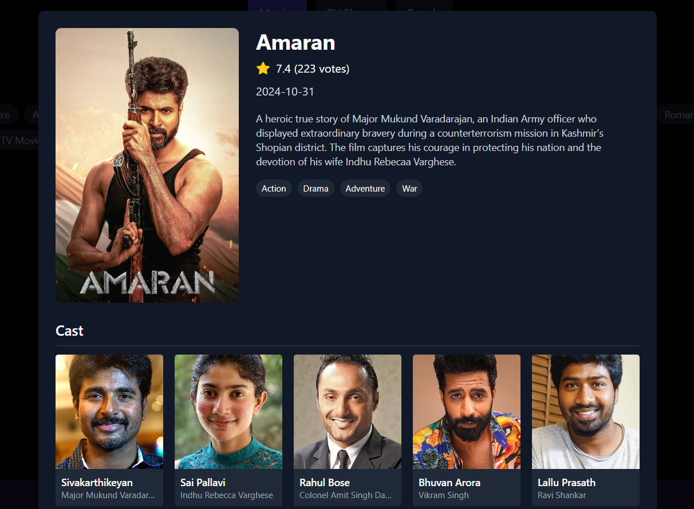
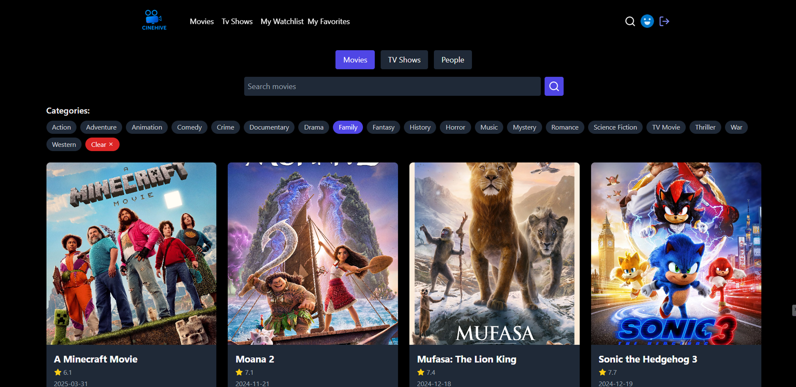
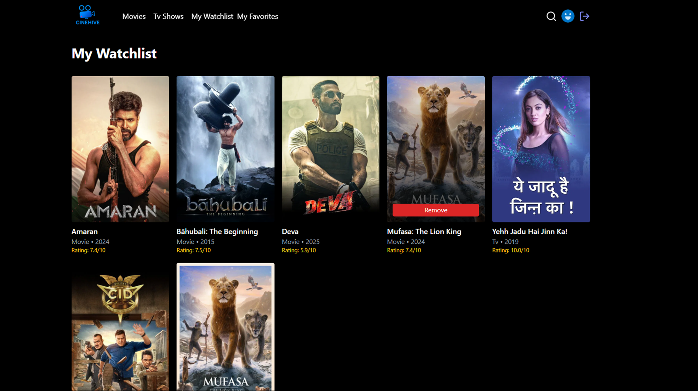
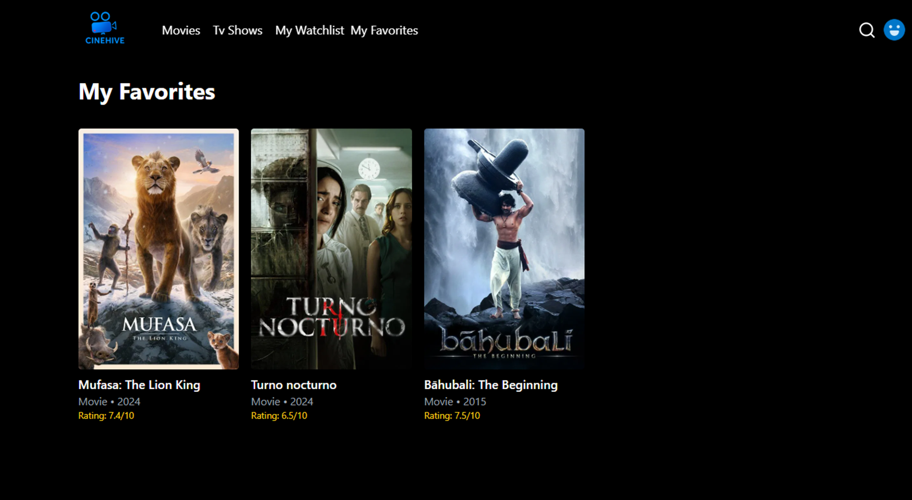

# CINEHIVE: A Modern Movie Catalog Website

CINEHIVE is an interactive and responsive platform tailored for movie enthusiasts to explore, browse, and manage their movie preferences seamlessly. By integrating The Movie Database (TMDB) API, the system provides real-time access to movie descriptions, trailers, and ratings, offering a modern alternative to traditional movie databases.

---

### Table of Contents

*   [About The Project](#about-the-project)
*   [Key Features](#key-features)
*   [Screenshots](#screenshots)
*   [Tech Stack](#tech-stack)
*   [Architecture and Database Design](#architecture-and-database-design)
*   [Getting Started](#getting-started)
    *   [Prerequisites](#prerequisites)
    *   [Installation & Setup](#installation--setup)
*   [API Integration](#api-integration)
*   [Challenges & Solutions](#challenges--solutions)
*   [Future Enhancements](#future-enhancements)
*   [Contact](#contact)
*   [License](#license)

---

## About The Project

In an era with thousands of movies released annually, users often face difficulty navigating vast, cluttered movie databases like IMDb. CINEHIVE addresses this issue by offering a **streamlined, user-friendly interface** to discover movies, view real-time data, and manage personal preferences.

The project emphasizes **usability, secure data management, and an aesthetically pleasing UI**, providing a personalized experience that platforms like IMDb or Rotten Tomatoes often lack. Users can create accounts, save their favorite movies, and build a personal watchlist, all within a secure and intuitive environment.

---

## Key Features

✨ **Real-time Movie Data**: Integrates with the TMDB API for up-to-the-minute information on movies and TV shows, including descriptions, ratings, trailers, and cast details.
🔐 **Secure User Authentication**: JWT-based authentication ensures user data is secure. Users can sign up, log in, and manage their sessions safely.
❤️ **Personalized Favorites & Watchlist**: Logged-in users can add movies to a personal "Favorites" list and a separate "Watchlist" for future viewing.
🎬 **Dynamic Movie Browsing & Discovery**: Browse movies by categories like "Now Playing," "Top Rated," and "Popular."
🔍 **Advanced Search & Filtering**: A powerful search functionality allows users to find movies by title and filter results by genre.
📱 **Responsive Design**: A modern UI built with React, Tailwind CSS, and Bootstrap ensures a seamless experience across all devices, from desktops to mobile phones.

---

## Screenshots

<table>
  <tr>
    <td align="center"><strong>1. Welcome / Landing Page</strong></td>
    <td align="center"><strong>2. User Authentication (Sign Uo)</strong>
    <td align="center"><strong>3. Login</strong></td>
  </tr>
  <tr>
    <td></td>
     <td></td>
    <td></td>
  </tr>
  <tr>
    <td align="center"><strong>3. Movie Details Page</strong></td>
    <td align="center"><strong>4. Film Overview & Cast</strong></td>
  </tr>
  <tr>
    <td></td>
     <td></td>
    <td></td>
  </tr>
  <tr>
    <td align="center"><strong>5. Browse & Filter by Genre</strong></td>
    <td align="center"><strong>6. User Watchlist Management</strong></td>
  </tr>
  <tr>
    <td></td>
    <td></td>
  </tr>
  <tr>
    <td align="center" colspan="2"><strong>7. User Favorites Management</strong></td>
  </tr>
  <tr>
    <td align="center" colspan="2"></td>
  </tr>
</table>

---

## Tech Stack

This project is built with a modern technology stack for a robust and scalable application.

| Layer      | Technologies                                            |
| :--------- | :------------------------------------------------------ |
| **Frontend** | React, Axios, Tailwind CSS, Bootstrap                   |
| **Backend**  | Node.js, Express.js                                     |
| **Database** | MySQL                                                   |
| **APIs**     | The Movie Database (TMDB) API                           |
| **Security** | JSON Web Tokens (JWT), bcrypt                           |

---

## Architecture and Database Design

The system is built on a client-server architecture with a relational database model. This design ensures efficient data organization and clear separation of concerns.

### Database ERD


[Database ERD](./Pictures/ER_Diagram.png)
 
### Database Schema

The database consists of four primary tables:

*   `users`: Stores user profile and authentication data (username, hashed password, email).
*   `movies`: Acts as a local cache or reference for movies, though most data is fetched live from the TMDB API.
*   `user_watchlist`: A junction table mapping users to the movies they've added to their watchlist (Many-to-Many relationship).
*   `user_likes`: A junction table mapping users to the movies they've marked as favorites (Many-to-Many relationship).

Foreign key constraints and indexes on `user_id` and `movie_id` are used to maintain data integrity and optimize query performance.

---

## Getting Started

To get a local copy up and running, follow these simple steps.

### Prerequisites

Make sure you have the following installed on your machine:
*   [Node.js](https://nodejs.org/en/) (v14 or later)
*   [npm](https://www.npmjs.com/) or [yarn](https://yarnpkg.com/)
*   A running [MySQL](https://www.mysql.com/) server

### Installation & Setup

1.  **Clone the repository:**
    ```sh
    git clone https://github.com/Dhiya-Natarajan/Movie-Catalogue.git
    cd Movie-Catalogue
    ```

2.  **Setup the Backend:**
    *   Navigate to the backend directory:
        ```sh
        cd backend
        ```
    *   Install NPM packages:
        ```sh
        npm install
        ```
    *   Create a `.env` file in the `backend` directory and add the following environment variables.
        ```env
        # .env
        DB_HOST=localhost
        DB_USER=your_mysql_user
        DB_PASSWORD=your_mysql_password
        DB_NAME=your_database_name
        JWT_SECRET=your_super_secret_jwt_key
        TMDB_API_KEY=your_tmdb_api_key
        ```
    *   Set up the database. Create a database in your MySQL server and run the provided schema file.
        ```sh
        # Replace with your actual credentials and schema file name
        mysql -u your_mysql_user -p your_database_name < schema.sql 
        ```
    *   Start the backend server:
        ```sh
        npm start
        ```
        The server will be running on `http://localhost:8800` (or the port you configure).

3.  **Setup the Frontend:**
    *   Open a new terminal and navigate to the frontend directory:
        ```sh
        cd frontend
        ```
    *   Install NPM packages:
        ```sh
        npm install
        ```
    *   Start the React development server:
        ```sh
        npm start
        ```
        The application will open automatically in your browser at `http://localhost:3000`.

---

## API Integration

This project relies heavily on **The Movie Database (TMDB) API** for all movie-related data.

*   To use the application, you need a TMDB API key.
*   You can obtain a free API key by creating an account on the [TMDB Website](https://www.themoviedb.org/signup).
*   Once you have your key, add it to the `.env` file in the `backend` directory as `TMDB_API_KEY`.

---

## Challenges & Solutions

During development, several challenges were encountered and resolved:

*   **Challenge**: Exceeding the TMDB API rate limits during testing.
    *   **Solution**: Implemented caching for common queries on the backend to reduce redundant API calls and stay within the usage quota.

*   **Challenge**: Designing a database schema that avoids redundancy while allowing fast data retrieval for user-specific lists.
    *   **Solution**: Utilized a normalized relational database design with junction tables (`user_watchlist`, `user_likes`) and foreign keys to efficiently manage many-to-many relationships.

*   **Challenge**: Managing secure user sessions and token expiration.
    *   **Solution**: Implemented JWT-based authentication with token refreshing mechanisms and stored tokens securely in HTTP-only cookies to protect session data.

---

## Future Enhancements

The following features are planned for future releases:

*   **User Reviews & Ratings**: Allow users to write reviews and give personal ratings to movies.
*   **Recommendation Engine**: Build a simple recommendation system based on a user's liked movies and viewing history.
*   **Mobile App Compatibility**: Develop a dedicated mobile application using React Native for an even better mobile experience.
*   **Social Features**: Allow users to follow each other and see what their friends are watching.

---
